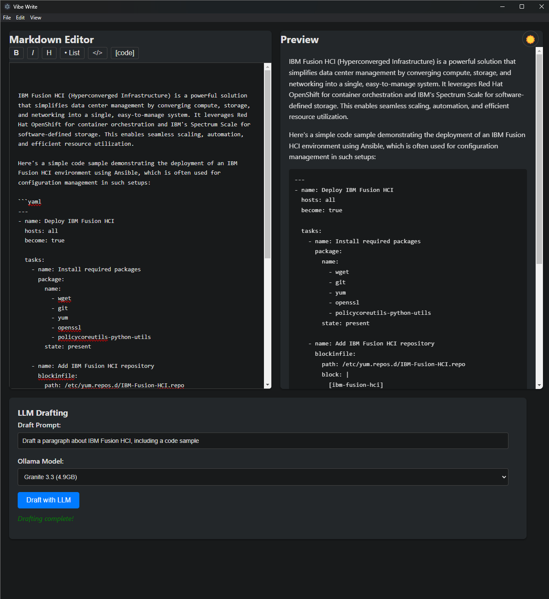

# Vibe Write

A modern, intuitive markdown authoring app with live preview and local LLM-powered drafting via Ollama. Now available as a desktop application!



## Overview
- **Purpose:** Foster a focused, pleasant writing experience with AI assistance.
- **Core Features:**
  - Markdown editor with live preview (Marked.js)
  - LLM drafting via local Ollama instance
  - Model selection dropdown (populates with your local Ollama models)
  - Formatting toolbar for quick markdown syntax
  - Light/dark mode toggle
  - Desktop application (Electron)

## Architecture
- **Security-First Design:**
  - Proper context isolation using Electron's `preload` scripts.
  - Secure IPC communication between main and renderer processes.
  - Protected renderer process (Node.js integration disabled).
- **Modular Structure:**
  - Preload script (`preload.js`) acts as a secure bridge for IPC.
  - Main process (`main.js`) handles application lifecycle, native OS interactions, and backend tasks (like LLM communication and Markdown parsing).
  - Renderer process (`script.js` for `index.html`) manages the UI and user interactions.

## Setup and Running the App

### Prerequisites
- **Ollama:**
    - [Ollama](https://ollama.com/) installed and running locally.
    - Ensure Ollama is accessible, typically at `http://127.0.0.1:11434`. The application is configured to use this address. If your Ollama instance uses a different address or port, you will need to update the fetch URL in `main.js`.
    - At least one LLM model pulled (e.g., `ollama pull granite3.3:latest`). The app's dropdown will list models available to your Ollama instance.
- **Node.js:** [Node.js](https://nodejs.org/) (v18 or later recommended for `fetch` support in main process, though `node-fetch` is included as a fallback).
- **npm:** (Usually comes with Node.js).

### Installation & Launch
1.  Clone or download this repository.
2.  Install dependencies:
    ```bash
    npm install
    ```
3.  Start the application in development mode:
    ```bash
    npm start
    ```
    This will launch the Electron app directly.

## Development
- The primary way to run and test during development is `npm start`.
- If you wish to test the web components in a browser (without Electron features), you can open `index.html`. Note that Electron-specific APIs (`window.api`) will not be available.

## Building the Desktop Application

The application uses `electron-builder` to create distributable packages.

### Build Prerequisites
- Ensure Node.js (v14 or later, though v18+ matches runtime better) and npm are installed.
- For platform-specific builds, ensure you are on or have the necessary toolchains for that platform (e.g., Windows for NSIS installer, macOS for DMG).

### Build Steps
1.  **Install Dependencies** (if you haven't already):
    ```bash
    npm install
    ```
2.  **Build for your desired platform:**
    -   Windows:
        ```bash
        npm run build:win
        ```
    -   macOS:
        ```bash
        npm run build:mac
        ```
    -   Linux:
        ```bash
        npm run build:linux
        ```
    -   Build for all configured platforms:
        ```bash
        npm run build
        ```

3.  **Find Your Executable/Installer:**
    Built applications are placed in the `dist` directory.
    -   Windows: `dist/Vibe Write Setup <version>.exe` (e.g., `Vibe Write Setup 1.0.0.exe`)
    -   macOS: `dist/Vibe Write <version>.dmg`
    -   Linux: `dist/vibe-write_<version>.AppImage` (and potentially other formats like `.deb`)

### Distribution
The `dist` directory will contain the packaged application:
- Windows: NSIS installer (`.exe`)
- macOS: DMG file (`.dmg`)
- Linux: AppImage, and possibly other formats like DEB.

### Running the Installed App
After building and running the installer (or opening the DMG/AppImage):
1.  **Windows:** Launch from the Start Menu or desktop shortcut.
2.  **macOS:** Open from the Applications folder.
3.  **Linux:** Run the AppImage directly or use the installed package if a `.deb` or similar was installed.

## Usage
- **Write Markdown:** Use the left pane to type markdown. The right pane previews it live.
- **LLM Drafting:**
  1. Enter a prompt (e.g., "Write an intro about AI").
  2. Select an available model from the dropdown (these are pulled from your local Ollama instance).
  3. Click "Draft with LLM" — the response is appended to your markdown.
- **Formatting:** Use the toolbar buttons for quick markdown syntax.
- **Theme:** Toggle between light and dark mode using the button in the top right.
- **Status messages** will indicate LLM drafting progress and any errors.

## Model Selection
- The dropdown lists models currently available to your local Ollama instance. Ensure the model names (including tags like `:latest`) are correctly reflected if you modify the HTML or dynamically populate this list.
- For general text, try models like `granite3.3:latest` or `phi4:latest`.
- For reasoning, `phi4-reasoning:latest` can be effective.

## Troubleshooting
- **Ollama not running:** Start Ollama (e.g., `ollama serve` in your terminal). If it's already running, you might see a "port in use" error, which is fine.
- **Model not found by app:**
    - Ensure the model is pulled in Ollama (`ollama list` to check, `ollama pull <model_name:tag>` to pull).
    - Verify the model name in the app's dropdown (and its `value` attribute in HTML) exactly matches the name in `ollama list` (e.g., `granite3.3:latest`).
- **Network issues / "Fetch Failed" error for LLM:**
    - Confirm Ollama is accessible at `http://127.0.0.1:11434`. The app is hardcoded to use this. If your Ollama is on a different IP or port, you must change the URL in `main.js` in the `draftWithLLM` handler.
    - Check for firewall or antivirus software that might be blocking local network requests from the Electron app.
- **Electron issues:**
    - Ensure Node.js and npm are correctly installed and versions are compatible.
    - If you encounter errors after pulling new code, try deleting `node_modules` and `package-lock.json`, then run `npm install` again.

## Next Steps
- Complete modular architecture implementation.
- Add TypeScript support.
- Implement comprehensive testing (unit, integration, E2E).
- File system integration (save/load markdown files).
- System tray integration.
- Auto-updates for the application.
- Explore additional native desktop features.

## Features
- **Intuitive formatting toolbar**: Bold and Italic buttons now trim spaces from selection, so formatting works even if you double-click a word (trailing spaces are handled for valid markdown).
- **Always-visible LLM controls**: The LLM drafting panel is always visible below the editor/preview, no scrolling required.
- **Responsive layout**: Adapts to different window sizes.
- **Theme toggle**: Light/dark mode toggle works reliably and remembers your preference via local storage.
- **Improved code block readability in dark mode**: Code blocks have a dark background and light text for better contrast.
- **Draft Prompt usability**: Pressing Enter in the Draft Prompt field submits the prompt (unless Shift is held for a newline).

---

*Made with ❤️ for a better writing vibe.* 