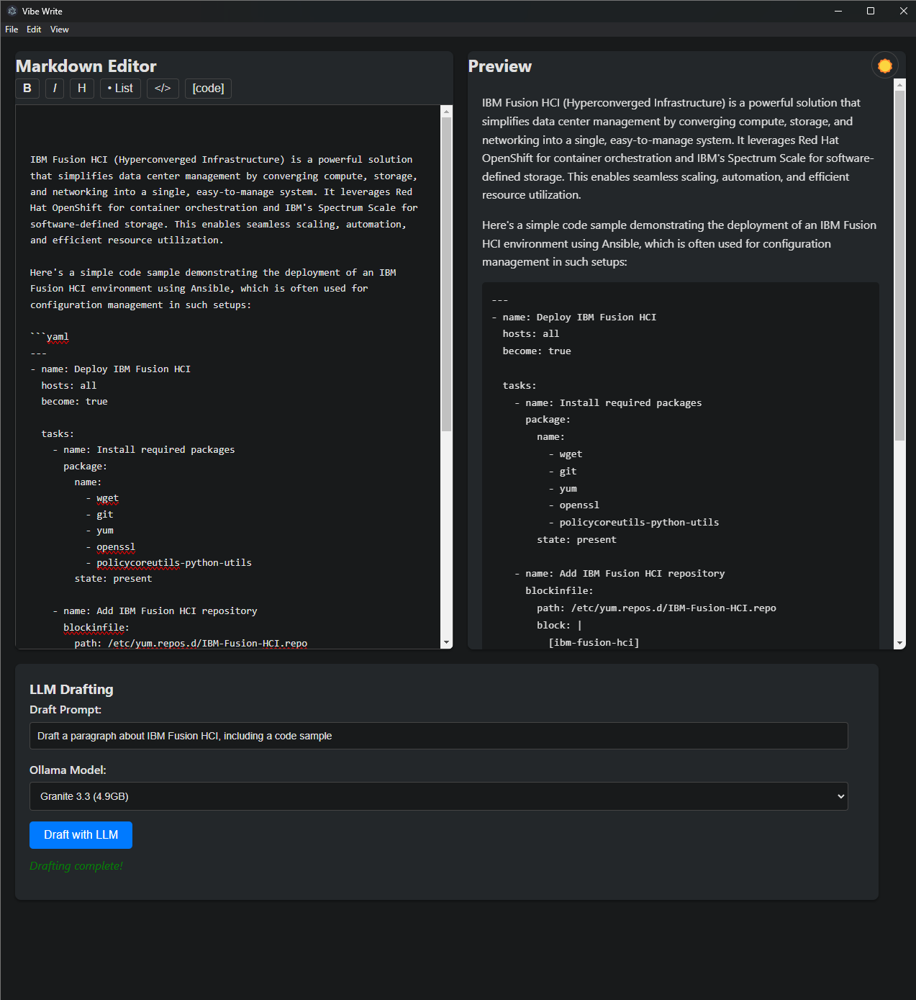

# Vibe Write

A modern, intuitive markdown authoring app with live preview and local LLM-powered drafting via Ollama. Now available as a desktop application!



## Overview
- **Purpose:** Foster a focused, pleasant writing experience with AI assistance.
- **Core Features:**
  - Markdown editor with live preview (Marked.js)
  - LLM drafting via local Ollama instance
  - Model selection dropdown for easy switching
  - Formatting toolbar for quick markdown syntax
  - Light/dark mode toggle
  - Desktop application (Electron)

## Setup
1. **Prerequisites:**
   - [Ollama](https://ollama.com/) installed and running locally
   - At least one model pulled (e.g., `ollama pull granite3.3`)
   - [Node.js](https://nodejs.org/) (for development)
   - Modern web browser (for web version)

2. **Install:**
   - Clone/download this repo
   - Install dependencies:
     ```bash
     npm install
     ```
   - Start the app:
     ```bash
     npm start
     ```

## Development
- **Web Version:** Open `index.html` in your browser
- **Desktop Version:** Run `npm start` to launch the Electron app
- **Build Desktop App:** (Coming soon)
  ```bash
  npm run build
  ```

## Usage
- **Write Markdown:** Use the left pane to type markdown. The right pane previews it live.
- **LLM Drafting:**
  1. Enter a prompt (e.g., "Write an intro about AI")
  2. Select a model from the dropdown
  3. Click "Draft with LLM" — the response is appended to your markdown
- **Formatting:** Use the toolbar buttons for quick markdown syntax
- **Theme:** Toggle between light and dark mode using the button in the top right
- **Status messages** indicate progress and errors.

## Model Selection
- Choose from your locally available models (e.g., Granite, Phi-4, Llama, etc.)
- For general text, try Granite 3.3 or Phi-4
- For reasoning, try Phi4-Reasoning
- For instruction following, try Granite 3.2 8B Instruct

## Troubleshooting
- **Ollama not running:** Start Ollama (`ollama serve`)
- **Model not found:** Pull the model with `ollama pull <model>`
- **Network issues:** Ensure Ollama is accessible at `http://localhost:11434`
- **Electron issues:** Check Node.js version and dependencies

## Next Steps
- File system integration (save/load)
- System tray integration
- Auto-updates
- Additional native features

## Features
- **Intuitive formatting toolbar**: Bold and Italic buttons now trim spaces from selection, so formatting works even if you double-click a word (trailing spaces are handled for valid markdown).
- **Always-visible LLM controls**: The LLM drafting panel is always visible below the editor/preview, no scrolling required.
- **Responsive layout**: Adapts to different window sizes.
- **Theme toggle**: Light/dark mode toggle works reliably and remembers your preference.
- **Improved code block readability in dark mode**: Code blocks have a dark background and light text for better contrast.
- **Draft Prompt usability**: Pressing Enter in the Draft Prompt field submits the prompt (unless Shift is held for a newline).

---

*Made with ❤️ for a better writing vibe.* 